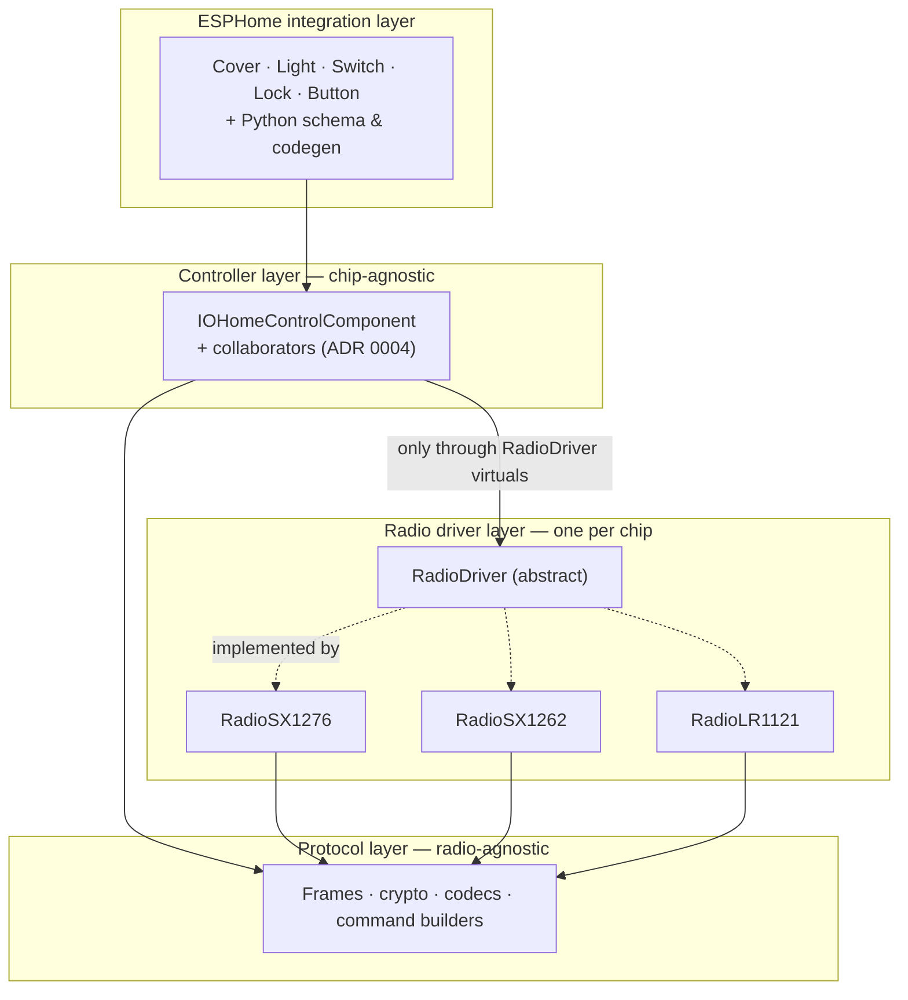

# ADR 0001: Layered protocol / radio-driver / hub architecture
<!-- doxygen-label: adr0001 -->

**Status:** Accepted · **Recorded:** 2026-08

## Context

The protocol — frames, cryptography, command building — must behave
identically on every radio chip. The hub — exchanges, pairing, poll
scheduling — must not know register layouts or IRQ semantics.

Without an enforced separation, a quirk fixed for one radio leaks into shared
code, and adding a chip means auditing every layer for hidden assumptions
instead of touching one seam.

## Decision

Three layers, each with a narrow contract to the one above it.

1. **Protocol layer** — frames, cryptography, codecs, command builders. No
   chip names, registers, or driver behavior anywhere in it, including in
   comments. Its timing header holds only chip-neutral protocol timing.
2. **Radio driver layer** — one driver per chip, all implementing the abstract
   `RadioDriver`. Chip-specific constants live in that chip's driver header;
   chip-specific *user-tunable* defaults live beside that chip's fields in the
   shared tuning config.
3. **Controller (hub) layer** — reaches the radio only through `RadioDriver`
   virtuals (`response_preamble()`, `hop_dwell_ms()`,
   `has_fast_tx_rx_turnaround()`, the TX/RX primitives, …). A chip needing
   different behavior gets a driver override with a chip-neutral contract —
   never an `if (chip == …)` branch in hub code. `chip_name()` exists, but is
   reserved for logging, never control flow.

`setup()` is the single **composition root**: its
`select_and_construct_radio_()` is the only function in the codebase that
names a concrete driver class.

## Consequences

- Adding a chip means a new driver class, its tuning defaults, and one branch
  in `select_and_construct_radio_()`. Protocol and hub code are untouched —
  which is what made adding LR1121, after SX1276 and SX1262, a driver-sized
  job rather than a cross-cutting one.
- The boundary is review-enforced, not compiler-enforced. A stray
  chip-identity branch in hub code compiles fine; it is a regression to catch
  in review, not a build failure.
- A driver-level fix stays contained and cannot alter behavior for a chip that
  never had the bug.
- Doxygen follows the same split: interfaces are documented as contracts
  ("drivers whose TX waveform needs more margin override this"), while the
  chip-specific *why* — measured values, validated workarounds — belongs on
  the override or the constant itself.
