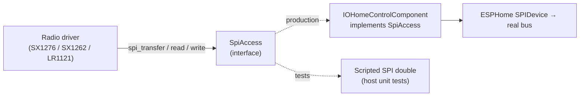

# ADR 0002: Direct SPI radio drivers instead of ESPHome's built-in radio components
<!-- doxygen-label: adr0002 -->

**Status:** Accepted · **Recorded:** 2026-08

## Context

ESPHome ships generic components for two of the three radio chips this project
supports — SX1276 (`sx127x`) and SX1262 (`sx126x`) — built around sending and
receiving payloads through a conventional radio API. The third, LR1121, has no
built-in component at all.

The protocol needs things those components do not expose, because they were
never designed for this access pattern:

- SX1276's hardware IoHomeOn framing mode, which the other two chips lack,
- preamble length and carrier frequency changed *per packet*, mid-exchange,
- tight TX→RX turnaround timing, since the device replies within a narrow
  window after the controller stops transmitting.

## Options considered

1. **Extend ESPHome's built-in components** to expose the low-level knobs.
   Would benefit their other users, but is gated on an upstream review cycle,
   pushes protocol-specific framing and timing into components meant to stay
   generic, and still leaves LR1121 unsupported.
2. **Write independent SPI drivers** scoped to exactly what this protocol
   needs.

## Decision

Option 2. Each chip gets a driver owning its SPI transport, register/opcode
handling, and IRQ management, exposing only what the protocol needs through
the shared `RadioDriver` interface (ADR 0001).

Drivers reach the bus through a small `SpiAccess` interface, which the hub
implements by delegating to ESPHome's `SPIDevice`. That keeps drivers
independent of ESPHome's SPI framework — and constructible in host tests
against a scripted SPI double.

## Consequences

- Full control over the timing and framing the protocol requires, on all three
  chips including LR1121, which has no upstream component.
- This project owns the entire driver surface per chip — register maps, IRQ
  handling, calibration, errata workarounds. Those bugs are ours to find, and
  bring-up on each chip has genuinely surfaced several (power-path selection,
  IRQ payload shapes, missing vendor calibration writes).
- Supporting a further chip needs a full driver against its own SPI command
  set; there is no shortcut through extending an upstream component.
- Depending only on `SpiAccess` makes every driver testable on the host
  without hardware.
