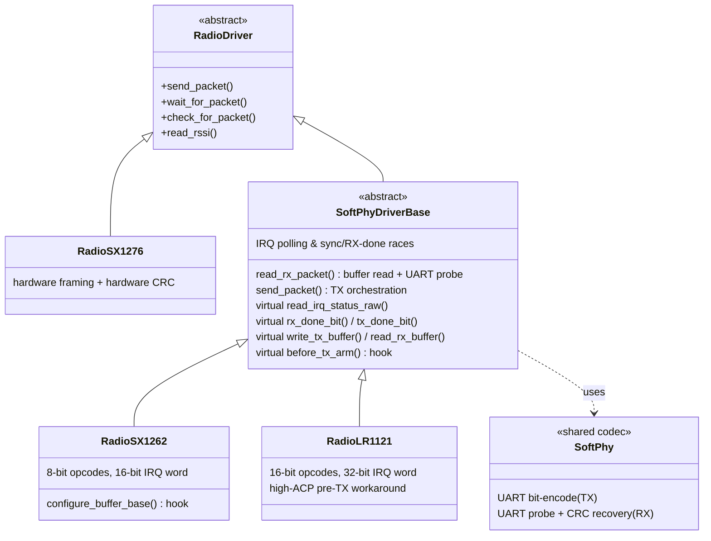

# ADR 0003: Shared software PHY and IRQ orchestration base for SX1262/LR1121

**Status:** Accepted · **Recorded:** 2026-08

## Context

The SX1276 implements the protocol's framing and CRC natively in hardware. The
SX1262 and LR1121 only offer generic GFSK, so both must reproduce that framing
in software: bit-level encoding on transmit, probe-and-recover with a software
CRC on receive.

Beyond that shared codec, the two drivers' IRQ-driven RX state machines and TX
orchestration turned out identical in every respect that wasn't chip-specific
transport or register encoding. Two copies meant a timing fix found on one
chip had to be ported and re-verified on the other, with both quietly drifting
in between.

## Decision

Two levels of sharing, with everything genuinely chip-specific behind
virtuals:

- **The software PHY** (`radio_soft_phy`) — TX bit-encoding and the RX
  probe/CRC-recovery pass — is shared verbatim. No chip-specific logic in it.
- **`SoftPhyDriverBase`** holds what both drivers do identically: IRQ polling
  and sync/RX-done race resolution, `read_rx_packet()`'s buffer read and probe
  recovery, `send_packet()`'s TX sequencing, the RSSI formula, and the shared
  preamble/post-TX-settle tuning fields.
- **Virtual primitives and hooks** carry what differs: SPI opcode encoding and
  transport, IRQ bit values and word width, register-level parameter encoding,
  and one-off steps only one chip needs (the SX1262's buffer-base write and its
  TX modulation-quality erratum; the LR1121's high-ACP pre-TX workaround and
  preamble-tolerant activity check).

### Length-driven receive

Neither chip's `RX_DONE` marks the end of a *frame*. With no hardware framing,
RX runs in fixed-length mode at the raw-probe length, so `RX_DONE` arrives a
fixed ~10 ms after the sync word however short the frame actually was — and
that delay lands on the protocol's tightest turnaround, the hub's reply to a
device's challenge.

A frame's own length is knowable long before then: `CTRL0` bits [4:0] carry it,
and `CTRL0` is the first byte after the sync word. So the shared flow reads the
first UART cell, computes how many raw bytes the frame will occupy, waits out
exactly that much air time, and reads it — no chip needs to tell it where the
frame ends.

CRC-CCITT is the gate on that path, and that is what makes it safe to take.
Any failure — a chip that turns out not to expose its buffer mid-reception, a
spurious sync detect, a mis-guessed length, a bit error — falls back to the
`RX_DONE` path, which re-reads the whole buffer from scratch. A wrong guess
costs latency; it cannot cost a frame. Chips opt in through
`early_rx_read_offset()`; the default declines, so a driver only takes this
path once its buffer is known to be readable mid-reception.

## Consequences

- A correctness or timing fix reaches both chips at once, instead of needing a
  second port and a second hardware re-verification.
- A future chip lacking hardware framing can derive from the same base rather
  than reimplementing RX/TX orchestration.
- **The shared code has no test file of its own.** It is exercised through
  each deriving driver's suite, via the same `protected virtual` seams the
  drivers override (and the test doubles override again). A change to the base
  must be checked against *both* suites — passing one proves nothing about the
  other.
- Some values that look chip-specific are deliberately shared because they are
  protocol properties: the raw-RX probe length, for instance, derives from the
  longest protocol frame after framing and CRC, so both drivers use one
  constant.
