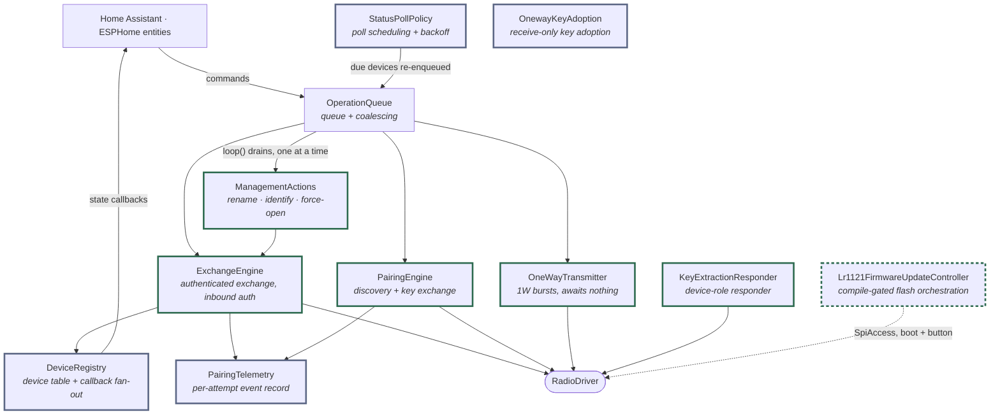

# ADR 0004: Hub responsibilities split into single-purpose collaborators
<!-- doxygen-label: adr0004 -->

**Status:** Accepted · **Recorded:** 2026-08

## Context

The hub accumulated several largely-independent responsibilities: authenticated
exchanges, discovery and pairing, administrative actions, the device table,
operation coalescing, poll scheduling, and pairing telemetry.

Holding all of that in one class risks unbounded growth and — worse —
entangles unrelated state machines through shared internal state, so a change
to poll scheduling can affect pairing for reasons no one intended.

## Decision

Each concern is owned by its own collaborator object, held **by value** inside
the hub component. The hub keeps only lifecycle, wiring, and dispatch.

Green marks the collaborators that reach the radio; the queue above the outbound
ones guarantees only one transmits at a time (`KeyExtractionResponder` replies
from the receive path, not the queue, but is self-gated so it only transmits
while explicitly armed). Grey marks the ones that only hold state and are driven
*by* the hub — receive-side handling updates the registry and the poll policy
from the same frame, but neither calls the other. `Lr1121FirmwareUpdateController`
is dashed because it exists only when `lr1121_firmware_update:` is configured, and
reaches the radio through `SpiAccess` in bootloader mode rather than the driver.

- **OperationQueue** — pending-operation queueing and per-type coalescing.
  `loop()` drains it, which is what serializes all radio work; ADR 0013 covers
  why that serialization *is* the concurrency model.
- **ExchangeEngine** — outbound authenticated exchanges (including retry and
  challenge-response) and inbound authentication.
- **PairingEngine** — device discovery and key exchange.
- **ManagementActions** — the administrative actions of ADR 0006.
- **DeviceRegistry** — the device table and update-callback fan-out to
  platform entities.
- **StatusPollPolicy** — per-device poll scheduling and failure backoff
  (cadence rules in ADR 0017).
- **PairingTelemetry** — per-attempt event recorder, shared by both engines.
  Its read-only companion (`pairing_advisor`) turns a finished attempt into
  actionable diagnostics.
- **OneWayTransmitter** — 1W command bursts (ADR 0026): the one radio-driving
  collaborator that awaits nothing, since 1W has no reply.
- **KeyExtractionResponder** — the device-role mirror of `PairingEngine`: while
  armed, it emulates an unpaired device so a foreign hub pairs *to* it and hands
  over its key (ADR 0012). The pure state-transition decisions stay in
  `pairing_responder.h/.cpp`; this collaborator owns only the impure half —
  arming, the throwaway node ID, the auto-off/grace timers, and the device-role
  reply transmit.
- **OnewayKeyAdoption** — receive-only: while armed, it decodes one overheard 1W
  `CMD_ONEWAY_ADD_CONTROLLER` and reports the recovered key. Holds arm state only;
  never transmits.
- **Lr1121FirmwareUpdateController** — *compile-gated* (`lr1121_firmware_update:`):
  orchestrates the boot-time bootloader read, the cached flash verdict, the
  two-press confirmation window, and the button-triggered flash / bootloader-rewrite
  sequences (ADR 0020, ADR 0021). The pure decisions live in
  `lr1121_firmware_decisions.h` and the SPI transport in
  `radio_lr1121_firmware_updater.h`; only the orchestration between them is here.

The hub file itself splits the same way: lifecycle and loop, queued dispatch,
and passive receive-side handling, plus thin wrappers over the collaborators.
Where a collaborator needs a *protected* hub capability (`set_timeout`,
`transmit_frame_`, `warn_if_blocking_over_`, `busy_`), the hub injects a
`std::function` built in its own member-initializer list rather than granting
`friend` — the same pattern `OneWayTransmitter` established for `transmit_frame_`.
The shared aliases for those callbacks live in `hub_hooks.h`, a dependency-light
header that never includes `hub_core.h`.

## Consequences

- Each collaborator is unit-testable in isolation against a scripted radio
  double, without standing up the whole hub. Several have their own suites.
- A new capability means a new collaborator with a narrow interface, rather
  than growing an existing class.
- Cross-collaborator coordination must be **explicit** at the hub level rather
  than falling out of shared state. That is more wiring code — and it is the
  point of the decision, not a side effect of it.
- By-value ownership keeps allocation static and lifetimes trivial, which
  matters on an embedded target; the cost is that the hub header must see
  every collaborator's full definition. A collaborator whose own header would
  drag heavy transitive includes back into `hub_core.h` (as
  `Lr1121FirmwareUpdateController` would via the firmware-image and decision
  headers) forward-declares those types in its header — legal for scoped enums
  with a fixed underlying type and for types it only holds by pointer — and
  pulls the full definitions into its `.cpp` alone.
