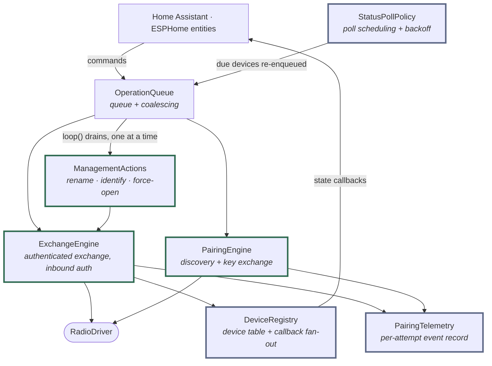

# ADR 0004: Hub responsibilities split into single-purpose collaborators

**Status:** Accepted · **Recorded:** 2026-08

## Context

The hub accumulated several largely-independent responsibilities: authenticated
exchanges, discovery and pairing, administrative actions, the device table,
operation coalescing, poll scheduling, and pairing telemetry.

Holding all of that in one class risks unbounded growth and — worse —
entangles unrelated state machines through shared internal state, so a change
to poll scheduling can affect pairing for reasons no one intended.

## Decision

Each concern is owned by its own collaborator object, held **by value** inside
the hub component. The hub keeps only lifecycle, wiring, and dispatch.

Green marks the three collaborators that reach the radio; the queue above them
guarantees only one does so at a time. Grey marks the three that only hold
state and are driven *by* the hub — receive-side handling updates the registry
and the poll policy from the same frame, but neither calls the other.

- **OperationQueue** — pending-operation queueing and per-type coalescing.
  `loop()` drains it, which is what serializes all radio work; ADR 0013 covers
  why that serialization *is* the concurrency model.
- **ExchangeEngine** — outbound authenticated exchanges (including retry and
  challenge-response) and inbound authentication.
- **PairingEngine** — device discovery and key exchange.
- **ManagementActions** — the administrative actions of ADR 0006.
- **DeviceRegistry** — the device table and update-callback fan-out to
  platform entities.
- **StatusPollPolicy** — per-device poll scheduling and failure backoff
  (cadence rules in ADR 0017).
- **PairingTelemetry** — per-attempt event recorder, shared by both engines.
  Its read-only companion (`pairing_advisor`) turns a finished attempt into
  actionable diagnostics.

The hub file itself splits the same way: lifecycle and loop, queued dispatch,
and passive receive-side handling, plus thin wrappers over the two engines.

## Consequences

- Each collaborator is unit-testable in isolation against a scripted radio
  double, without standing up the whole hub. Several have their own suites.
- A new capability means a new collaborator with a narrow interface, rather
  than growing an existing class.
- Cross-collaborator coordination must be **explicit** at the hub level rather
  than falling out of shared state. That is more wiring code — and it is the
  point of the decision, not a side effect of it.
- By-value ownership keeps allocation static and lifetimes trivial, which
  matters on an embedded target; the cost is that the hub header must see
  every collaborator's full definition.
