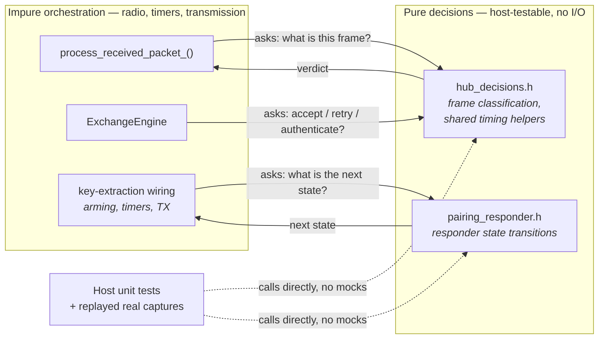

# ADR 0005: Pure decision logic kept separate from I/O

**Status:** Accepted · **Recorded:** 2026-08

## Context

Exchange, pairing, and status handling all branch on frame contents in ways
that are easy to get subtly wrong: the wrong flag checked, an endpoint match
too permissive, an off-by-one in a state transition.

Entangled with the radio I/O that produces those frames, such bugs surface
only against real, timing-sensitive traffic — hard to reproduce, harder to pin
under a fast regression test.

## Decision

Decisions are side-effect-free functions: frame and state data in, a
classification or next state out. No radio calls, no timers, no member state.
The orchestration code that *does* have side effects calls them and branches
on the result — it never re-implements the same reasoning inline.

This applies in both directions: the hub's outbound flows
(`hub_decisions.h`) and the device-role responder of ADR 0012
(`pairing_responder.h`), which mirrors the split for the reverse role.

## Consequences

- Covered by fast host-only tests needing no radio or timing mocks, and the
  golden-frame corpus (ADR 0010) replays straight through the real classifiers.
- Edge cases awkward to provoke on live hardware — malformed frames, unlikely
  state combinations — are trivial to construct as direct function inputs.
- Review-enforced, not compiler-enforced. Branching logic added under time
  pressure can still land on the impure side if it isn't deliberately placed.
- The pure side can only see frame and state data. A decision genuinely needing
  a timer or radio query must be restructured to take the already-read value as
  a parameter, rather than reaching for it.
