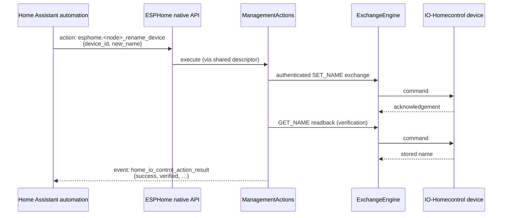

# ADR 0006: Hub-level admin operations as native API actions, not permanent entities

**Status:** Accepted · **Recorded:** 2026-08

## Context

Renaming a device, forcing it open, or asking it to identify itself are used
rarely and per-device — typically once during setup or while troubleshooting,
not as part of everyday operation.

## Options considered

1. **A generated helper entity per operation per device** (a button each).
   Consistent with how the rest of the component exposes functionality, but
   multiplies controls that may be pressed once ever across every device and
   every operation, permanently cluttering the entity list.
2. **ESPHome native API actions**, callable by device ID from an automation,
   script, or the Developer Tools UI, with no permanent entity footprint.

## Decision

Option 2. `rename_device`, `identify_device`, and `force_open_device` are
registered as node-scoped native API actions.

All three share **one data-driven descriptor class**, parametrized by action
name, argument list, and a callback that unpacks the request's string
arguments. Adding a fourth action is a registration call, not a new class.

Results come back as an event rather than an entity state, so the triggering
automation can inspect success and verification details without anything
persistent existing to hold that state.

The component enables the required native-API compile-time flags internally,
so user YAML needs only a normal `api:` block. Host unit tests must define
those same flags, or the registration path compiles out and the action tests
silently cover less than they appear to.

## Consequences

- No permanent entity exists for these operations, keeping them out of the
  everyday entity surface.
- The cost is discoverability: a rarely-used action does not surface by
  browsing entities — it has to be found through the node's action list or the
  documentation. That is the intended trade.
- Action names derive from the node's normalized `esphome.name`, not its
  friendly name, so documentation and automations must use the normalized form.
- Because all three share one descriptor, a fourth or fifth operation costs a
  registration call rather than new boilerplate.
