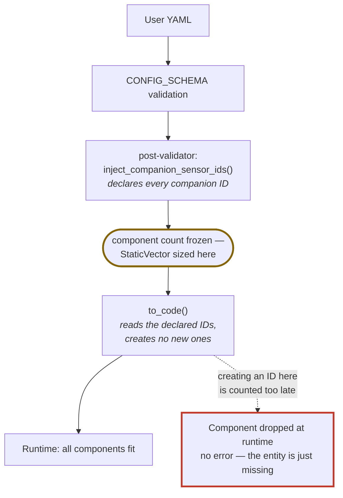

# ADR 0009: Companion entity IDs are declared during schema validation

**Status:** Accepted · **Recorded:** 2026-08

## Context

Several platforms generate companion entities alongside their main one — the
per-device diagnostic sensors (device name, active issue, RSSI, last contact,
exchange failures), a favorite-position button next to a cover, a ventilation
button for window-type covers. Each needs an ESPHome component ID.

Creating that ID inside `to_code()` is the intuitive place, and it used to
work. Current ESPHome sizes its runtime component vector (`StaticVector`) from
the number of component IDs known **at the end of schema validation** — before
`to_code()` runs at all. An ID created later isn't counted. Nothing errors:
the vector overflows at runtime and later components are silently dropped, so
their `setup()` never executes.

That failure has no build-time or validation-time signal. It shows up as an
entity mysteriously missing from a device, which is a far worse thing to
debug than a build error.

## Decision

Every companion ID is created by a post-validator during `CONFIG_SCHEMA`
evaluation. `to_code()` only reads the already-declared ID back out of the
validated config — it never creates one.

The injection lives once in the shared platform module and is reused by every
device-bound platform, so adding a companion sensor touches one file rather
than four.

## Consequences

- This is a hard requirement for any platform generating a companion entity,
  not a style preference — getting it wrong produces no diagnostic at all.
- The parent's own ID may not be resolved yet at validation time, since an
  auto-generated `id:` isn't assigned until later. The ID-derivation step
  therefore needs a deterministic fallback based on the entity's name, and
  cannot assume the parent ID is known.
- Which config key holds the parent ID varies by platform (light reads it from
  its output ID, the others from the standard ID key), so the shared helper
  takes that key as a parameter rather than assuming one.
- Any new platform generating a companion entity should follow this pattern
  from the start rather than rediscovering the failure mode.
