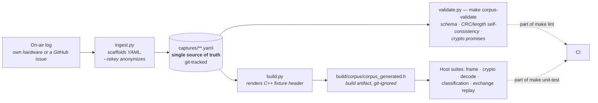

# ADR 0010: Real captured frames are the regression-test source of truth
<!-- doxygen-label: adr0010 -->

**Status:** Accepted · **Recorded:** 2026-08

## Context

The protocol has enough undocumented, device- and chip-specific edge cases
that hand-written fixtures only ever cover what someone already thought to
write. A byte sequence someone invented to look plausible proves nothing when
the question is what real hardware actually sends.

A frame captured off the air — including an awkward one, a device refusal, a
length edge case — is evidence. It happened.

## Decision

Real captured frames are committed as git-tracked YAML at
`tests/corpus/captures/<phase>/<id>.yaml`, one file per scenario, with
`filename == id` and the id naming its subject and protocol phase
(`<subject>_<phase>[_<scenario>][_<chip>]`). Nothing in the tooling reads the
path — it is grouped by phase purely because that is the axis the corpus is
reached from; every other axis is a one-line `ls`/`grep`, and issue provenance is
carried in `source.issue`, not a directory. Tooling scaffolds a capture from a
pasted on-air log, validates it
(including `filename == id`, that each capture sits in its phase directory, and
that every capture path cited across the tree resolves), and compiles it into
test fixtures.

The YAML is the only stored copy of the data. The C++ header is regenerated on
every test build and git-ignored, so there is no second copy that can drift
and nothing to keep in sync by hand.

`validate.py` enforces more than shape: CRC and length fields must be
self-consistent with the frame bytes, and a capture claiming its crypto
verifies under the public corpus key must actually do so.

## Consequences

- A report from real hardware becomes a permanent regression fixture the day it
  is captured, rather than requiring someone to hand-construct an equivalent
  and possibly get a detail wrong. The working rule: a device-specific protocol
  bug isn't fixed until its capture is in the corpus.
- Coverage reflects what has actually been seen in the field, not what was
  anticipated.
- **Pairing captures leak the real system key if committed as captured** — the
  transfer key is public, so anyone with the raw bytes can recover the key.
  Ingestion therefore supports re-keying: verify the crypto under the real key
  locally, rewrite every crypto-bearing frame under the public corpus key, and
  mark the capture as such. The real key never reaches a committed file.
- Committed bytes are immutable afterwards. Expected-value fields may be
  corrected by hand when the code's prior behavior was itself the bug, but the
  raw bytes are not editable — that is what keeps them evidence.
- Getting the raw bytes of a pairing exchange requires the maintainer-only
  build flag of ADR 0011, precisely because normal builds cannot produce them.
