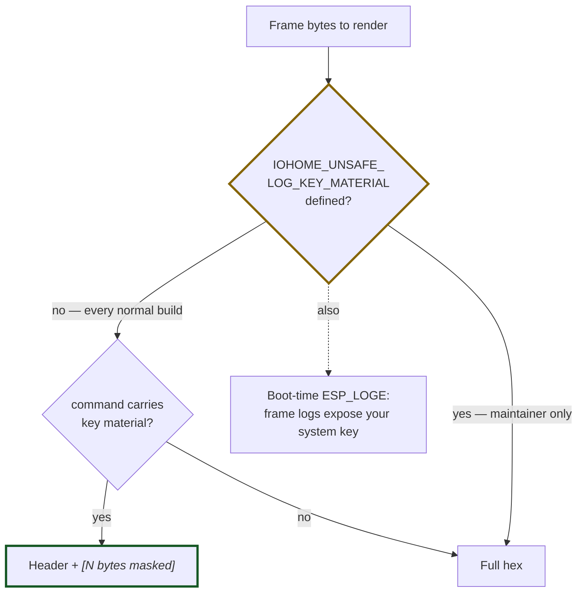

# ADR 0011: Key material is masked wherever frames are logged, unconditionally

**Status:** Accepted · **Recorded:** 2026-08

## Context

Frame logging is a normal, encouraged debugging aid — the project's own issue
template asks users to enable it and share the output. But one protocol
command carries the system key in transit during pairing, obfuscated only with
a transfer key that is public and hardcoded. Anyone holding those raw bytes
can recover the key.

So the single most likely way a user leaks their system key is by doing
exactly what the documentation told them to do.

## Decision

Masking is a property of *rendering frame bytes to text*, not of any logging
verbosity setting. Every path that renders a frame checks whether its command
carries key material and, if so, prints the header and replaces the payload
with a byte count.

Note the frame-logging flag itself is *not* in this diagram: it controls
whether frames are logged at all, never whether the payload is masked. A
second, independent check scans arbitrary debug buffers for the key appearing
anywhere in them, as a last-resort net against a path that renders bytes some
other way.

Producing the real bytes — needed once, to build a re-keyed corpus fixture per
ADR 0010 — requires a distinct, maintainer-only build flag. When it is
defined, the component logs a loud error at every boot.

## Consequences

- A user following the documented "enable debug logging and share the log"
  workflow cannot leak their system key, even for the one command that carries
  it. The frame-logging option cannot switch masking off.
- The unsafe flag exists only because building the regression corpus needs the
  real bytes once, under maintainer control. It is documented as never
  appropriate for a bug-report log, and its boot-time error makes an
  accidentally-shipped build obvious.
- Any new surface that renders frame bytes — telemetry, diagnostic reports, a
  future capture tool — must route through the same masking helper rather than
  formatting bytes itself. The helper lives in the protocol layer so every
  layer above can reach it.
- Masking preserves the header, so a masked log stays useful: command,
  endpoints, and flags remain readable; only the payload is withheld.
