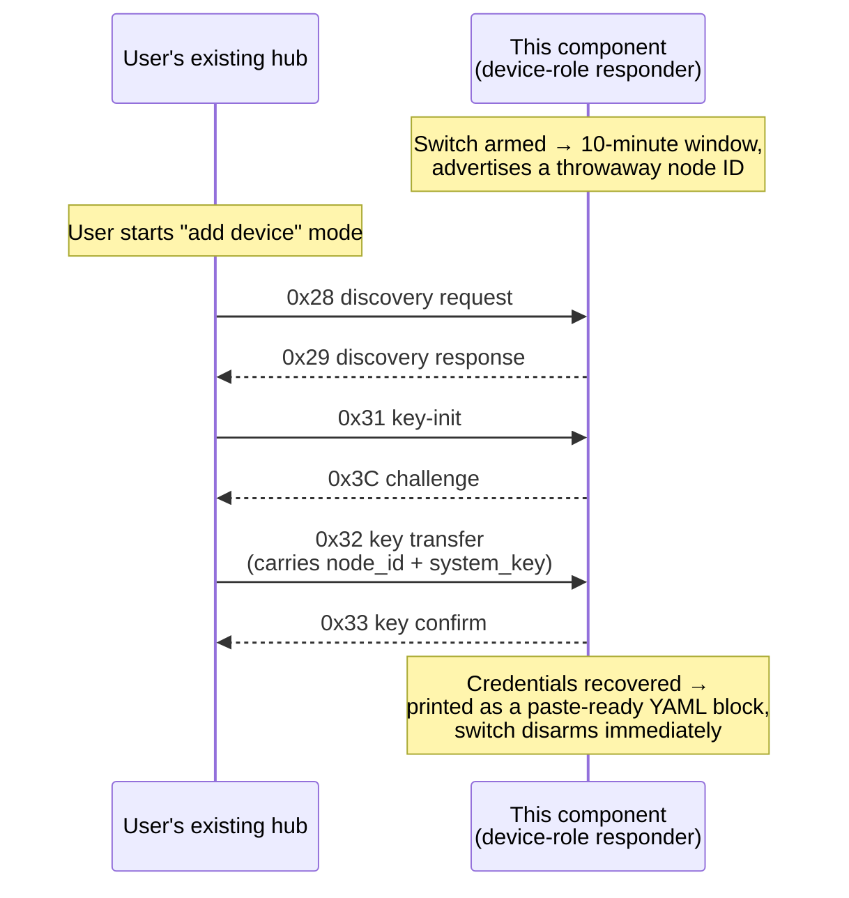

# ADR 0012: Key-extraction responder for recovering credentials from an owned installation

**Status:** Accepted · **Recorded:** 2026-08

## Context

Someone who owns a working installation — a hub plus paired devices — and
wants to also control it from this component needs that installation's
`node_id` and `system_key`. Those live on the existing hub, and normal pairing
cannot retrieve them: pairing runs hub-to-device, for a device not yet paired
to anyone.

The alternatives are factory-resetting a device (losing its pairing) and
sniffing a fresh pairing with separate hardware, or extracting the credentials
from the other hub some other way. Both are worse than the problem.

## Decision

The hub can optionally play the **device** role: it emulates an unpaired
device so the user's existing hub pairs to it exactly as it would to a new
shutter, and hands over its credentials as a normal part of that handshake.

It is opt-in at two levels: a hub-level config option must be set for the
control to exist at all, and that control must then be switched on to arm.
The arm window is bounded at ten minutes and the switch always boots off, so a
reboot can never leave it armed. Recovered credentials are printed once as a
ready-to-paste config block.

Structurally this is `PairingEngine`'s mirror image: same handshake, opposite
role. It follows the split of ADR 0005 — pure state transitions in one header,
with arming, throwaway ID generation, transmission, timers, and the result log
kept on the impure side.

## Consequences

- This works only against a hub the user can already put into pairing mode —
  the same handshake pairing already performs, initiated by the other hub, not
  interception of an exchange between parties the user doesn't control. It is
  documented as recovery tooling for an installation the user owns, with the
  corresponding legal note.
- **Hardware-confirmed, but not against a third-party hub.** A full extraction
  between two boards — one running this responder, the other this project's own
  pairing flow — recovered the credentials byte-for-byte over real RF,
  validating the crypto, state machine, and radio wiring. It does *not*
  validate compatibility with a commercial hub: the discovery-response fields
  and the IV-derivation assumption came from this project's own encoder and a
  handful of captures, and a real hub may check things this responder does not
  satisfy. Treat a recovered key as unconfirmed until it actually controls a
  device.
- Pure state transitions mean the responder is host-tested without a radio,
  including the paths that matter most — an attempt that stalls at each phase.
- A timed-out attempt reports which phase it reached, making a missed frame
  diagnosable rather than a silent failure.
