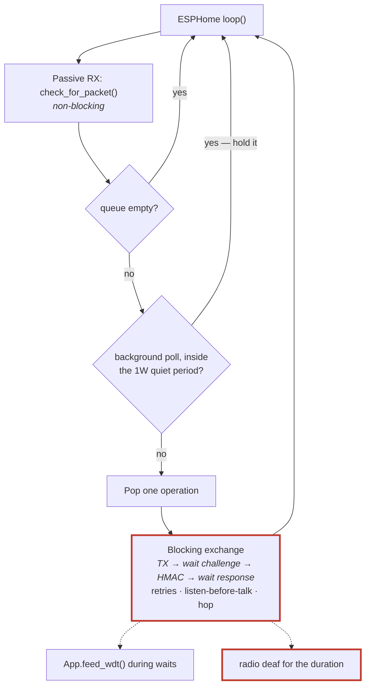

# ADR 0013: Radio work is blocking, on the ESPHome loop, with no FreeRTOS tasks

**Status:** Accepted · **Recorded:** 2026-08

## Context

An authenticated exchange is not a single send: request, wait for a challenge,
HMAC reply, wait for the real response — with retries, listen-before-talk, and
frequency hopping in between. End to end that is one to three seconds, and the
reply must be caught within a narrow slot after transmitting.

ESPHome components run cooperatively on a single loop. Blocking it for seconds
starves everything else and, without care, trips the watchdog.

## Options considered

1. **A FreeRTOS task for radio work**, letting the exchange block freely on
   its own stack while the loop stays responsive. Standard on ESP32 — but it
   puts the device registry, tuning config, and entity callbacks on a thread
   boundary, so each needs synchronization it currently doesn't have. It also
   makes a system whose bugs are already timing-shaped harder to reason about.
2. **A fully asynchronous exchange engine** — the exchange rewritten as a
   state machine advanced by `loop()`, never blocking. Evaluated as a redesign
   and rejected: it spreads one linear, readable protocol sequence across many
   resumption points, and every driver would have to support suspend/resume
   mid-exchange rather than simply waiting.
3. **Blocking on the loop**, feeding the watchdog during waits, with
   queue-level mitigations for the latency it costs.

## Decision

Option 3. All radio work happens in `loop()` or blocking methods called from
it, feeding the watchdog during waits. No FreeRTOS tasks or queues anywhere.

Since the single radio can serve only one exchange at a time, this is not
purely a constraint — the `OperationQueue` (ADR 0004) *is* the concurrency
model, drained one entry at a time by `loop()`, serializing all radio access
without locking.

Three queue behaviors keep the cost tolerable: user control commands outrank
background polls; enqueueing a control command for a device drops any queued
poll for it, since the command's own reply carries fresher state; and a queued
background poll briefly yields after one-way remote traffic, so a poll the hub
itself scheduled does not start on top of the burst that triggered it.

## Consequences

- **An in-flight exchange cannot be interrupted.** Worst-case added latency for
  a user command is one full exchange — one to three seconds — no matter what
  the queue does. That is the accepted price, documented rather than hidden.
- **The radio cannot receive while an exchange runs.** The hub is deaf to
  everything on the air for its full duration, so passive features — overheard
  status updates, one-way sender events (ADR 0016) — have a blind spot. It bites
  hardest when the hub's own work causes it: a press on a linked remote
  schedules a status poll, and dispatching that poll while the remote is still
  transmitting blinds the hub to the rest of that press. Hence the quiet period
  above. This cost is **not** specific to blocking — one half-duplex radio
  cannot listen while it transmits and waits — so an asynchronous engine would
  inherit it unchanged. Only the mitigations follow from this decision.
- **The 1W quiet period has no cap.** It re-arms on every 1W frame received
  while active, so it holds a background poll back for as long as 1W traffic
  keeps arriving less than `quiet_ms` apart — including from a neighbour's
  hardware, since these broadcasts carry no ownership marker. A real remote's
  burst is short (~160 ms) and the poll is only delayed, never dropped, so this
  is accepted rather than bounded. The residual risk is sustained sub-`quiet_ms`
  1W traffic from any source starving background polls, and therefore device
  state freshness, indefinitely, with no diagnostic surfaced today.
- No shared state crosses a thread boundary, so the registry, tuning config,
  and entity callbacks need no locking.
- Every blocking loop must feed the watchdog. One that forgets is a reset
  waiting to happen — not something the compiler catches, so the driver-level
  timeout tests assert on it directly: each one snapshots the feed count before
  a forced timeout and checks it advanced, which fails if a wait loop stops
  feeding. A missing call is still possible in code the tests don't reach —
  this closes the gap for the wait primitives, not for every future one.
- Drivers can be straight-line code that waits for an IRQ, which is much of why
  a driver for a new chip is tractable at all (ADR 0002).
- If sustained responsiveness ever became a hard requirement, revisiting this
  means revisiting options 1 and 2 together — the blocking style is
  load-bearing for the driver design, not an isolated choice in the hub.
