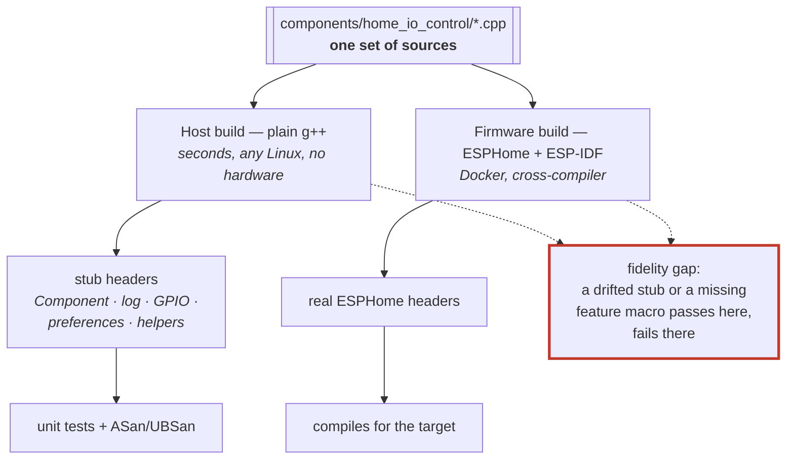

# ADR 0014: Host unit tests build against stubbed ESPHome headers
<!-- doxygen-label: adr0014 -->

**Status:** Accepted · **Recorded:** 2026-08

## Context

The component's logic — frame parsing, cryptography, exchange and pairing
state machines, poll scheduling, queue coalescing — is ordinary C++ with no
real dependency on ESP32 hardware. But it is written as an ESPHome component,
so it includes ESPHome headers for `Component`, logging, GPIO, preferences,
and helpers.

Testing by building ESPHome would pull a Python toolchain, a cross-compiler,
and a firmware build into every test run: slow, needs Docker, and couples the
suite to whichever framework version happens to be installed.

## Options considered

1. **Test on real firmware / an emulator.** Highest fidelity, far too slow to
   run on every change, and it cannot easily assert on internal state.
2. **Build the tests against ESPHome itself** on the host. Removes the
   hardware, but keeps the heavyweight toolchain dependency and the version
   coupling.
3. **Hand-written stub headers** providing just the ESPHome API surface the
   component actually touches, so tests compile with a plain host compiler.

## Decision

Option 3. A small set of stub headers under the test tree reimplements the
narrow slice of ESPHome the component uses. Tests build and link with plain
`g++` — no ESPHome, no ESP-IDF, no Docker, no hardware.

The stubs are not merely empty shims: where a test needs to observe an
interaction, the stub records it. The `Component` stub's `set_timeout`/
`set_interval`/`cancel_*` (and the two entry points production code reaches
directly through `App.scheduler`) are all backed by one pending-timer registry
(`test_scheduler::Registry`), so a test can have several devices' polls
pending at once — not just the single most recent call — and either assert on
them directly (`test_scheduler::pending()`) or drive them by calling
`run_due()` (fire whatever is due right now) or `run_until(target_ms)` (walk
the clock forward stop by stop, firing each deadline it crosses, the way a
real device's `loop()` would). The compat fields a test could already read or
write by hand (`last_timeout_name_`, `last_timeout_callback_`, …) still exist
and are still updated on every call, for tests that fire a captured callback
directly instead.

Time itself is a separate stub, `test_clock` (`tests/include/esphome/core/
hal.h`): a default *legacy* mode, bit-for-bit the original per-call counters,
and an opt-in *manual* mode (`test_clock::ManualClock`, RAII-scoped to one
test) where `millis()`/`micros()` read off a single clock a test moves
explicitly. Manual mode is what makes `run_until()` meaningful; it is opt-in
because the radio chip drivers busy-poll the clock in a loop with no other
exit condition, which would spin forever under a clock that never advances on
its own — a built-in guard aborts the test if that happens, rather than
hanging CI.

Protected internals are reached through small `Testable*` subclasses that
promote the members a test needs. The production build keeps normal C++ access
control — there is no test-only weakening of the real classes.

Both builds compile the *same* component sources; only the headers underneath
differ. That is the whole idea, and also the whole risk.

## Consequences

- The full suite builds and runs in seconds on any Linux host and in CI with no
  ESPHome installed — which is what makes running it on every change realistic.
- **The stubs are a maintenance surface.** A new ESPHome API means growing the
  stub, and a stub that drifts from real behavior makes a test pass while the
  firmware fails. Compiling the real firmware is therefore a separate mandatory
  check; the host suite alone is never sufficient evidence.
- Some code only compiles when the right feature macros are defined. The host
  build must define the same ones the component injects into the firmware
  build, or whole paths silently vanish and their tests cover nothing. This has
  bitten the native-API action path specifically (ADR 0006).
- The same property that makes the suite fast makes the sanitizer build
  practical: identical sources run under ASan/UBSan in a separate object tree
  as part of the normal test target.
- The registry models two real-scheduler fidelity details closely enough to
  reproduce their bugs: a static-name timer matches by the caller's pointer
  first, falling back to `strcmp` (catching exactly the dangling-pointer class
  of bug a dynamically-built name can cause), and a Component-keyed item is
  skipped while its component `is_failed()`, while a self-keyed item never is.
  It does not model everything real ESPHome does: an interval's first fire
  uses a zero offset rather than the real scheduler's small random one, items
  due at the same timestamp fire in this test's own (deadline,
  insertion-order) order rather than replicating the real scheduler's
  same-timestamp defer-across-`loop()`-iterations behavior, and a pending
  item's deadline is a plain `uint32_t` compared without wraparound handling
  — a clock moved (via `test_clock::set_ms()`) to near its 32-bit limit while
  items are pending would see them all appear due at once, rather than
  surviving the wrap the way a real device's scheduler does.
