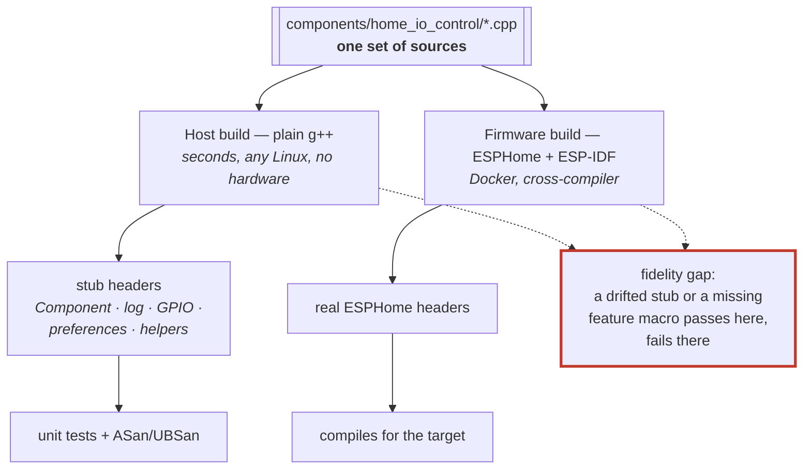

# ADR 0014: Host unit tests build against stubbed ESPHome headers
<!-- doxygen-label: adr0014 -->

**Status:** Accepted · **Recorded:** 2026-08

## Context

The component's logic — frame parsing, cryptography, exchange and pairing
state machines, poll scheduling, queue coalescing — is ordinary C++ with no
real dependency on ESP32 hardware. But it is written as an ESPHome component,
so it includes ESPHome headers for `Component`, logging, GPIO, preferences,
and helpers.

Testing by building ESPHome would pull a Python toolchain, a cross-compiler,
and a firmware build into every test run: slow, needs Docker, and couples the
suite to whichever framework version happens to be installed.

## Options considered

1. **Test on real firmware / an emulator.** Highest fidelity, far too slow to
   run on every change, and it cannot easily assert on internal state.
2. **Build the tests against ESPHome itself** on the host. Removes the
   hardware, but keeps the heavyweight toolchain dependency and the version
   coupling.
3. **Hand-written stub headers** providing just the ESPHome API surface the
   component actually touches, so tests compile with a plain host compiler.

## Decision

Option 3. A small set of stub headers under the test tree reimplements the
narrow slice of ESPHome the component uses. Tests build and link with plain
`g++` — no ESPHome, no ESP-IDF, no Docker, no hardware.

The stubs are not merely empty shims: where a test needs to observe an
interaction, the stub records it. The `Component` stub, for instance, captures
the most recent `set_timeout`/`set_interval` name, delay, and callback, so a
test can assert that a follow-up poll was scheduled with the right delay and
then invoke the callback directly to drive time forward.

Protected internals are reached through small `Testable*` subclasses that
promote the members a test needs. The production build keeps normal C++ access
control — there is no test-only weakening of the real classes.

Both builds compile the *same* component sources; only the headers underneath
differ. That is the whole idea, and also the whole risk.

## Consequences

- The full suite builds and runs in seconds on any Linux host and in CI with no
  ESPHome installed — which is what makes running it on every change realistic.
- **The stubs are a maintenance surface.** A new ESPHome API means growing the
  stub, and a stub that drifts from real behavior makes a test pass while the
  firmware fails. Compiling the real firmware is therefore a separate mandatory
  check; the host suite alone is never sufficient evidence.
- Some code only compiles when the right feature macros are defined. The host
  build must define the same ones the component injects into the firmware
  build, or whole paths silently vanish and their tests cover nothing. This has
  bitten the native-API action path specifically (ADR 0006).
- The same property that makes the suite fast makes the sanitizer build
  practical: identical sources run under ASan/UBSan in a separate object tree
  as part of the normal test target.
