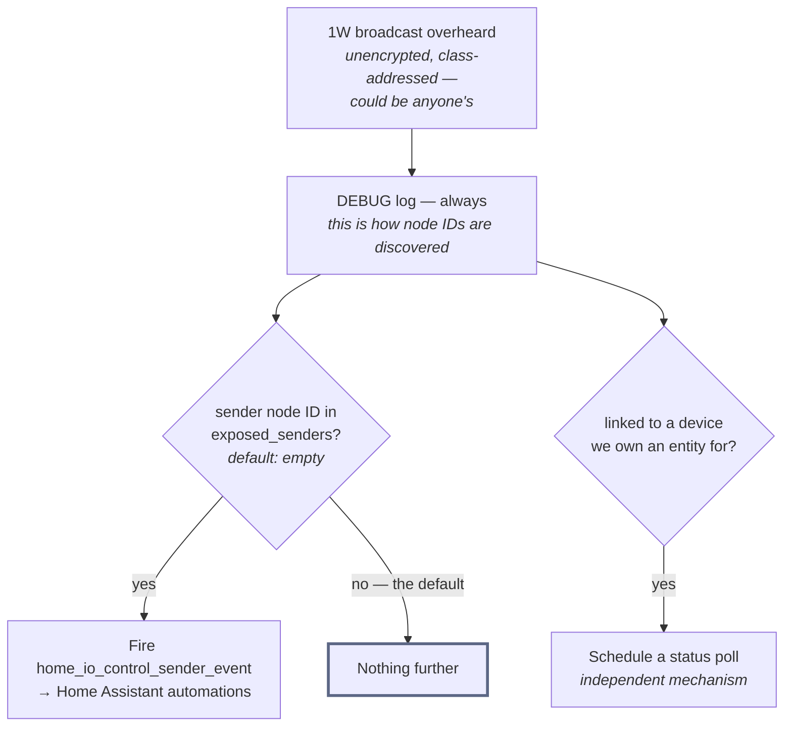

# ADR 0016: Sender events are opt-in, by explicit allowlist

**Status:** Accepted · **Recorded:** 2026-08

## Context

Handheld remotes, wall switches, and wind/rain sensors all announce themselves
the same way: an unencrypted one-way broadcast addressed to a device *class*
("all awnings"), not to a particular hub. There is no ownership marker on the
radio — a receiver cannot tell whether a transmission came from the user's own
remote or a neighbour's identical one within range.

Surfacing these to Home Assistant is genuinely useful: it turns a physical
remote into an automation trigger, including a spare remote that controls no
device the user owns an entity for. But doing it for every overheard
transmission would mean a neighbour's button presses appearing as events in
the user's own home, indistinguishable from their own.

## Decision

Every decoded one-way transmission is logged at debug level regardless of
configuration — that is how a user discovers node IDs in the first place.

Firing a Home Assistant *event* is separate and requires the sender's node ID
to appear in an explicit allowlist, which defaults to empty. Nothing produces
an event until the user names it.

The option is deliberately called "senders" rather than "remotes". Handheld
remotes and weather sensors are indistinguishable on the radio except for one
payload byte identifying the originator — a wind sensor is simply a device
that broadcasts "close, wind" — so one allowlist covers both rather than
implying the feature is only for handheld controls.

This is a separate mechanism from the linked-remote list, which drives status
polling for a device the user does own. A sender can be on one list, the
other, or both.

The two branches below the log are independent: allowlisting a sender does not
link it to a device, and linking does not make it fire events.

## Consequences

- The default is silent: a fresh install fires no sender events at all. The
  user must read a node ID out of the debug log and add it, which is a real
  setup step and the intended cost.
- A neighbour's remote cannot reach the user's automations by accident. It can
  still appear in debug logs, which is unavoidable — the frames are broadcast
  in clear and simply arrive.
- Adding a device to the allowlist is not a claim of ownership and the radio
  cannot verify one. The allowlist is a filter on what the user chose to react
  to, not an authorization boundary, and should not be described as one.
- Naming the concept "sender" from the start avoids a rename later when the
  first person points a wind sensor at it.
- Events are best-effort, not guaranteed: the radio is deaf while an exchange
  runs (ADR 0013), so a transmission arriving in that window fires nothing. The
  allowlist decides what *may* fire, never that every press is heard.
