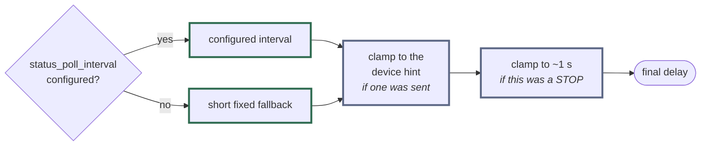

# ADR 0017: A device's settle hint may shorten the poll interval, never stretch it

**Status:** Accepted · **Recorded:** 2026-08

## Context

After a command, the hub polls a device until it reports a stable state. Two
sources have an opinion about how soon to poll again: many devices report a
settle hint in their status reply, and the user may configure a poll interval
per entity.

They disagree constantly, and each has a legitimate claim. The device knows
how long its own movement takes. The user knows how much radio traffic they
are willing to spend — the single radio is shared with everything else the hub
does (ADR 0013), so polling too eagerly directly delays other commands.

## Decision

The follow-up delay is `min(device hint, configured interval)` — the device
may shorten the user's interval, never extend it. The configured interval is a
**ceiling** on the cadence, not a target.

Three rules fall out of that:

- No configured interval: the hint drives the cadence directly, with a short
  fixed fallback when a device sends no hint.
- A STOP command additionally caps the delay to about a second, whatever the
  hint or interval say, because a stop should confirm its resting position
  promptly.
- Polling is bounded either way: it stops as soon as the device reports a
  stable state, and gives up after a bounded window.

Read left to right: a **starting point**, then two **clamps**. Both clamps use
`min`, so every stage can only reduce the delay — there is no path on which a
device's hint makes the interval longer than the user configured.

Resolving the delay is a pure function of those three inputs, testable
directly per ADR 0005.

## Consequences

- A user who sets a slow interval to keep the radio quiet still gets prompt
  feedback on a device that reports a short settle time, because the hint is
  allowed to shorten it.
- A user who sets a *fast* interval cannot have it silently overridden into
  something slower by a device that reports a long hint. Their configured
  value is the guaranteed upper bound on latency.
- **The asymmetry is the decision, and it has regressed before.** "Take the
  device's hint" and "take the configured interval" both read as reasonable
  one-line simplifications, and either one alone breaks half the contract. A
  change here needs a test that pins both directions.
- Settling and periodic monitoring stay distinct: resolving a settle delay
  never turns a device into a periodic poller. Ongoing monitoring after rest
  remains opt-in via the configured interval.
