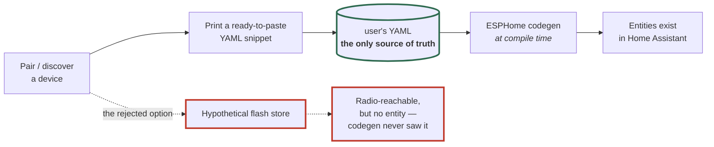

# ADR 0018: YAML is the source of truth; the hub persists no state of its own

**Status:** Accepted · **Recorded:** 2026-08

## Context

Pairing discovers a device: its ID, type, and subtype. A hub could write that
to flash and start controlling it immediately — that is how commercial hubs
behave, and what a user coming from one expects.

But an ESPHome node's configuration *is* its YAML file. Entities are declared
there and generated at compile time; there is no runtime mechanism to add one.
A device known only from flash could be reached over the radio yet would have
no entity in Home Assistant.

## Options considered

1. **Persist discovered devices to flash** and rebuild the table at boot.
   Removes the reflash step, but splits configuration across a YAML file the
   user edits and a flash blob they cannot see, creating states where the two
   disagree. Entities still couldn't be created for a flash-only device — so
   the win is partial while the confusion is total.
2. **Keep YAML the only source of truth** and persist nothing.

## Decision

Option 2. The component writes nothing to persistent storage. Every device it
acts on is declared in YAML, and the device table is rebuilt from that config
at every boot.

Pairing therefore ends by *printing a ready-to-paste YAML snippet* rather than
saving anything. The user pastes it in and reflashes.

Metadata learned at runtime — a device type recovered from radio metadata, a
cached name, RSSI history — lives in RAM only and is re-learned after a
reboot. It is a cache, never a record.

The system key and node ID are likewise YAML configuration, which is why
recovering them from an existing installation (ADR 0012) also ends in a
paste-and-reflash step rather than writing them to flash.

The dashed path is why persisting to flash wins less than it appears to:
entities come from codegen, so a device known only to flash could be commanded
over the radio but would have nothing in Home Assistant to command it *from*.

## Consequences

- **Pairing requires a reflash to finish.** That is the real cost, it is
  user-visible, and it is documented as part of the workflow rather than
  smoothed over.
- A node's entire behavior is reproducible from a file the user can read, diff,
  and version. Reflashing the same YAML onto a replacement board reproduces the
  installation exactly, with no hidden state to migrate or lose.
- No flash state can disagree with the config, so there is no migration story
  and no "clear stored data" recovery step.
- Nothing about a paired device survives a factory reset of the *board* —
  nothing was on the board. The pairing lives in the device and in the system
  key.
- Entity-level persistence is separate and still available where ESPHome
  provides it: the key-extraction switch, for instance, deliberately always
  boots off rather than restoring its previous state.
- **One narrow exception exists**, recorded in
  [ADR 0025](0025-persist-monotonic-counters-as-the-only-exception-to-0018.md):
  the 1W rolling-sequence counter is persisted, because it is neither
  configuration nor re-learnable from the air — a 1W device never transmits, so
  nothing reports the high-water mark our counter has to stay ahead of. The
  exception covers monotonic counters and nothing else; devices, keys and node
  IDs stay YAML-only under this ADR.
