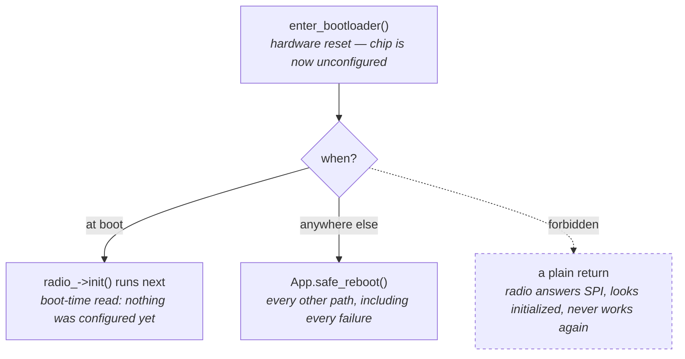

# ADR 0020: Flash LR1121 transceiver firmware, not the bootloader

**Status:** Accepted · **Recorded:** 2026-08

## Context

The LR1121's radio firmware is field-upgradable and versioned by Semtech,
separately from this component. This project already *reported* that version at
boot and pointed at Semtech's release notes when it looked outdated, but the
only official way to act on that was Semtech's own reference tool, which
targets an ST Nucleo dev board, not this project's hardware. Rather than
require unrelated hardware and tooling just to apply an update, this project
builds its own updater on top of the same underlying wire mechanism (the
bootloader-mode SPI transport and opcodes) Semtech's tool uses, so a flash can
be triggered directly from the existing build via a Home Assistant button.

Two facts shape the problem. First, Semtech gates each transceiver image on the
**bootloader** version beneath it: `0x0101`/`0x0102`/`0x0103` require bootloader
`0x2100`, and `0x0104` requires `0x2101`. Second, moving `0x2100` → `0x2101` is
a separate operation with its own opcode family (`0x8100`/`0x8101`/`0x8102`)
that rewrites the bootloader itself.

That second operation is categorically riskier than the first, and the reason is
structural rather than statistical. Entering bootloader mode is a GPIO strap —
BUSY held low across a reset — so it does not depend on the transceiver firmware
being valid or even present. Erasing and rewriting the transceiver region is
therefore always undoable: whatever state a failed write leaves behind, the next
reset still lands in the bootloader and a retry still works. A failed bootloader
write would remove exactly that property, because the bootloader is what makes
bootloader-mode re-entry — and therefore recovery from *anything* — possible at
all. A bricked bootloader is not recoverable by this project.

## Options considered

1. **Report only, as before.** Zero risk, but the component keeps telling users
   about an update it gives them no way to apply, and the vendor path is
   inaccessible on the hardware this project actually targets.
2. **The full capability, including the bootloader-updater opcodes.** Reaches
   `0x0104` — which matters, since that release fixes CVE-2025-14857/-14858/-14859.
   The cost is that a failed bootloader write has no recovery path in-project.
3. **Transceiver region only, bootloader deferred.** Gives up `0x0104` on chips
   that shipped with `0x2100` for now, and keeps every failure recoverable.

## Decision

Option 3. The component can flash **any** Semtech-published LR1121 transceiver
image the user points it at, and does not call the `0x81xx` bootloader-updater
opcodes. The goal for the transceiver-firmware path is the general capability,
not a particular version — a firmware Semtech publishes after this code was
written must work without a code change here.

Bootloader updates are the categorically riskier operation described above and
are not implemented. This is a staged decision, not a permanent one: the
transceiver-only capability ships first because it is unconditionally
recoverable, and whether to add the bootloader-updater path is a question to
revisit once that capability has a track record, not something ruled out for
good.

The image is not vendored. A `lr1121_firmware_update:` block names a
`github://` path; the build fetches it, verifies it against its `.bin.md5`
sidecar, and generates a header. The block's mere presence is the build flag, so
adding one line and removing it again is the whole lifecycle — deliberately a
recompile each way rather than a runtime toggle, because a build that can erase
the radio should not be the build that runs permanently.

The load-bearing safety rule is about what happens *after* a bootloader
excursion, not before it. Entering bootloader mode resets the chip, which
destroys everything `configure_radio_()` set up; `Reboot(0x00)` returns the chip
to its firmware but does not restore that configuration. So:

There is no third branch. An early `return` on an error path is the one way to
get this wrong, and it fails silently rather than loudly, which is why it is
stated as an invariant rather than left to reviewer attention. This holds even
when `enter_bootloader()` itself reports failure: its entry sequence runs
unconditionally, on GPIO lines, before the confirmatory read that determines its
return value, so a failure there means entry could not be confirmed, not that it
did not happen.

Every input to the flash decision — bootloader version, installed firmware
version, target version — is known before the user presses anything and cannot
change afterwards, so the verdict is computed once at boot and printed in the
config dump. A rejection therefore costs no chip access at all: the button reads
a cached verdict rather than resetting the radio to re-derive one.

The bootloader/target compatibility table is treated as a **depreciating
snapshot**, not an allow-list. A known-incompatible pair is refused, but a target
the table has never heard of is routed through a two-press confirmation rather
than rejected — otherwise the feature would rot the first time Semtech ships
anything new.

## Consequences

- **The one release users most want is the one this cannot reach yet.** On a
  chip that shipped with bootloader `0x2100`, `0x0104` — the CVE-fixing release
  — is unreachable, and `0x0103` is the ceiling. This is the direct, deliberate
  cost of staging the riskier operation for later, not an oversight.
- Every transceiver-flash failure short of physical damage is a retry. A power
  loss mid-write, an erase timeout, or a write timeout leaves a chip whose
  transceiver region is incomplete but whose bootloader is untouched; the next
  boot still reads the bootloader, `init()` fails, and the button still works
  well enough to re-flash. The failure messages say this explicitly, because the
  natural reaction to a device going quiet is a power cycle.
- A gated build is not free: one extra radio reset on every boot to read the
  bootloader version, plus the image itself in flash (65 KB for `0x0104`,
  245 KB for `0x0101`). Removing the block removes both.
- Measured on hardware (a `1.3` image, 16648 words): erase took ~2.5 s and the
  chunked write ~2 s, comfortably inside the BUSY timeouts used. Progress logs
  stream over both the serial console and the still-live API connection for the
  whole ~4.5 s the flash blocks the ESPHome loop; no loop-chunked rewrite of the
  write path was needed.
- Bootloader-mode code is a standalone class rather than an addition to
  `RadioDriver`/`RadioLR1121`, which gain zero new surface area. That is partly
  separation of concerns and partly forced: `RadioLR1121::write_command_()`
  takes a `uint8_t` length, and `WriteFlashEncrypted` needs 260 parameter bytes
  in one NSS cycle.
- The wire protocol is verified against Semtech's published source rather than
  inferred — opcodes, the byte-denominated flash offset advancing 256 per chunk,
  the reboot parameter encoding, the GetVersion response layout, and the
  compatibility matrix all match `Lora-net/SWTL001` verbatim. The BUSY-strap
  bootloader-entry sequence is the exception: it is not in the published tree's
  reachable files, and was confirmed by a real hardware flash instead.
- Byte-exact host tests prove the component sends what it believes the protocol
  to be. A real hardware write is what validated the offset semantics the tests
  alone could not catch a misreading of.
