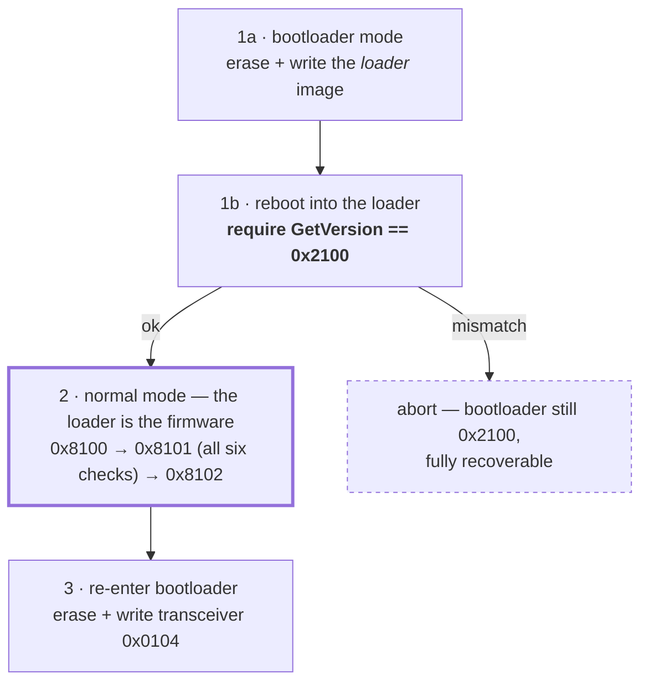

# ADR 0021: Flash the LR1121 bootloader, behind an arming switch

**Status:** Accepted, hardware-confirmed · **Recorded:** 2026-08 · **Supersedes:** [ADR 0020](0020-flash-lr1121-transceiver-firmware-not-the-bootloader.md)

## Context

ADR 0020 built a transceiver-firmware updater and deliberately stopped short of the bootloader,
recording that as staged rather than permanent: *"whether to add the bootloader-updater path is a
question to revisit once that capability has a track record, not something ruled out for good."*
The transceiver path has since shipped and run on real hardware. This is that revisit.

**The motivation is the security gap 0020 booked as its main cost.** Per Semtech's advisory
SEM-PSA-2026-001, quoted in 0020, a transceiver-only updater most likely leaves CVE-2025-14859
(CVSS 7.0, a secure-boot weakness) open, because `0x0104` requires bootloader `0x2101` and secure
boot is the bootloader's own job. `0x0104` on `0x2101` is the first configuration this project can
reach that plausibly closes all three. That the CVEs need physical SPI access does not make the gap
acceptable indefinitely; it makes it something to close carefully rather than urgently.

**Semtech's reference implementation.** `SWTL001` contains a complete
bootloader updater (`application/bootloader_update/`, `application/bootloader_updater_driver/`) and
publishes the loader image alongside the transceiver images. This removes the "we would have to
infer the protocol" objection that stood behind part of 0020's caution. It also settled a claim
0020 made in the other direction: the BUSY-strap bootloader-entry sequence *is* in the published
tree, and both of its wait values match what this project shipped.

What has **not** changed is the risk asymmetry that drove 0020. Entering bootloader mode is a GPIO
strap, so rewriting the transceiver region is always undoable. `0x8100` rewrites the thing that makes
that true. A failed bootloader write is not recoverable by this project, and no amount of design
changes that.

## Options considered

1. **Stay at transceiver-only**, as 0020 decided. Zero new risk, but leaves the security gap 0020
   itself identified open indefinitely, while the component keeps telling users about an update it
   will not apply.
2. **Bootloader update as an ordinary feature**, reachable from the existing button once configured.
   Reaches `0x0104`, but makes the risk of a familiar gesture depend on a YAML line the user may
   have edited months earlier.
3. **Bootloader update behind a separate, explicitly-armed gate**, with the recovery image proven
   resident at build time.

## Decision

Option 3.

The component gains an optional `bootloader:` sub-block inside `lr1121_firmware_update:`. Its
presence is the build flag, exactly as the outer block's presence already is — adding a line and
removing it again is the whole lifecycle, a recompile each way. A build that can rewrite the
bootloader should not be the build that runs permanently.

There is **no second button.** The existing flash button keeps its contract and gains one refusal
branch. The `bootloader:` block also conjures a hub-level arming switch, and the button will not
perform a bootloader write unless that switch is on. An unarmed press refuses from the verdict
already cached at boot, touching no hardware at all, and names both versions and the switch to
enable.

An arming switch rather than the two-press confirmation used elsewhere in this component, because
the armed state is **visible in Home Assistant**. "Am I about to do the irreversible thing?" is
answerable by looking rather than by remembering whether an invisible window is still open. For an
operation with no undo, one more entity is a fair price.

The switch has **no auto-off timer**. A timeout firing partway through a ~10 s three-stage flash
would itself be a hazard, and the window is already bounded: `restore_mode` is `ALWAYS_OFF`, and
every path after `enter_bootloader()` ends in `App.safe_reboot()` (0020's invariant, carried
forward). A completed *or failed* flash therefore reboots the ESP32 and clears the switch.
Armed-until-reboot is armed-until-next-flash.

**The load-bearing safety rule is a build-time one:** declaring `bootloader:` alongside a `source:`
whose target is known to require bootloader `0x2100` is a compile error. This guarantees the recovery
image is already resident in ESP32 flash before anything is erased, so "I upgraded the bootloader and
now have no firmware and no image to write" becomes a config mistake the build rejects rather than a
brick. The rule stays three-way, like 0020's runtime compatibility rule: a target the table has never
heard of is accepted with a warning, not refused, so the feature does not rot on Semtech's next
release.

The operation is a single user action with three internal stages, because bootloader-only is not a
coherent thing to offer:

Stage 1a erases the transceiver region, so the radio has no firmware from that moment until stage 3
completes. Stage 1b is not bookkeeping: it is the last checkpoint before the irreversible write, and
the failure it catches — a loader that did not land — is precisely the one that would otherwise turn
into a brick. Stage 2 is the only unrecoverable step.

Two facts about stage 2 are counterintuitive enough to state here rather than leave to code comments.
First, `0x8100`/`0x8101`/`0x8102` are **normal-mode commands of the loader firmware**, not
bootloader-mode commands; the `0x8xxx` prefix misleads. Second, its success condition is inverted:
after `0x8102` the chip is expected *not* to boot the firmware, because the new `0x2101` bootloader
refuses the loader image built for `0x2100`. Success is the chip staying in the bootloader and
reporting `0x2101`.

Two conditions never reach the three-stage path, however the switch is set: a target firmware version
this build does not recognise, and a boot-time bootloader read that failed. Both are cases where the
existing transceiver-only feature correctly falls back to a two-press confirmation, and neither
supplies the knowledge an irreversible write would need. The cost is that a `bootloader:` block
configured against an unrecognised target is inert until the pairing is added to the compatibility
table — a one-line edit, and the right price for not guessing here.

Separately, and independently of this feature, a `source:` naming a **loader** or **modem** image is
now rejected at config validation. Semtech's own tool refuses the loader case outright; this project
did not, and would have routed it through the ordinary unknown-target confirmation and left the radio
running the loader — functional over SPI, useless as a radio. A modem image reaches the same place by
a different route, since its filename yields no parseable version. That is a fix to already-shipped
behaviour and ships on its own, ahead of this feature.

## Consequences

- **The security gap 0020 booked as its main cost is closed**, which is the entire motivation.
  `0x0104` on `0x2101` becomes reachable on a board that shipped with `0x2100`.
- **One operation in this component can destroy hardware.** Every other failure mode in this project
  is a retry; a failed `0x8100` is not. The arming switch, the build-time recovery-image rule, and
  the stage-1b checkpoint reduce the window to a single write, but do not eliminate it. Power
  stability is a genuine precondition and cannot be checked in software, so it is stated in the log
  immediately before the write and in the docs, not pretended away.
- **0020's reassurance does not carry over.** Its "every failure short of physical damage is a retry"
  holds for stages 1 and 3 and is false for stage 2. The per-stage failure messages differ
  deliberately; a shared message would be a lie in one of the three.
- **The upgrade is a practical one-way door.** `0x8101` reports an anti-rollback check, and the
  matrix pairs `0x2101` only with `0x0104`+. If `0x0104` regressed something this project depends on,
  `0x0103` would not be available as a fallback. The anti-rollback bit's exact semantics are
  **undocumented** — absent from the LR1121 User Manual, which predates the updater by three years,
  and uncommented in Semtech's source — so this is inference, deliberately left untested, since the
  experiment that would confirm it destroys a board.
- **Anti-rollback is not a safety net and is not presented as one.** It is reported after the write
  has happened, and it addresses downgrade attacks rather than write failures.
- **A previously unreachable error message becomes reachable.** The existing
  `REJECT_BOOTLOADER_TOO_OLD` verdict fires on a bootloader/target mismatch in *either* direction,
  but until now nothing could produce a `0x2101` chip, so only the "too old" direction occurred. A
  user who upgrades and leaves `source:` pointing at `0x0103` now hits the other one, where the
  message would be exactly backwards. The verdict therefore gains a direction check — a change to
  the transceiver-only build, caused by this feature rather than contained in it.
- The decision logic is added as a post-filter over the existing `lr1121_flash_decision()` rather
  than as changes inside it, so a build without the `bootloader:` block keeps every existing path and
  test unchanged. That is a testable property, not just an intention.
- Two images in ESP32 flash instead of one, ~85 KB total, and ~10 s of blocked ESPHome loop instead
  of ~4.5 s. Both disappear when the block is removed.
- The wire protocol is again verified against `Lora-net/SWTL001` rather than inferred, and the
  `0x81xx` opcodes have no other public specification — the User Manual documents the bootloader
  command set only up to `0x800D`. Both images this build embeds were additionally compared
  word-for-word against Semtech's own vendored headers and are byte-identical.

## Outcome

Executed successfully on a LilyGO T3-S3 on 2026-08-07: bootloader `0x2100` → `0x2101`, transceiver
firmware `1.3` → `1.4`, radio functional afterwards. The staged verification (baseline read, a
recoverable transceiver flash, the build-time guards, the switch-off refusal, then the rewrite) ran
in order with no surprises.

Measured, where the design had only estimates:

| Step | Duration |
|---|---|
| Stage 1a — erase + write loader (4896 words) | 2474 ms + 584 ms |
| **Stage 2 — `0x8100` UpdateBootloader** | **~370 ms** (against a 30 s timeout budget) |
| Stage 3 — erase + write transceiver (16304 words) | 2474 ms + 1945 ms |

Total ≈ 10 s, matching the estimate. `VerifyBootloader` returned all six checks set and the status
read reported `command_status = OK`, so neither diagnostic had to be exercised in anger.

Two values undocumented by Semtech are now known, and both changed the code:

- **The loader firmware reports `type = 0xDE`** from a normal-mode GetVersion. That is one bit away
  from the bootloader's `0xDF`, so the Stage 1b checkpoint — the last gate before the irreversible
  write — was tightened from "not `0xDF`" to "is `0xDE`". The weaker form would have accepted a
  single-bit corruption of precisely the byte it exists to trust.
- **Bootloader `0x2101` does not return a usable GetHash**: a fixed `0x14` followed by fifteen zero
  bytes, observed twice across two code paths and two images, where `0x2100` returned a plausible
  digest. The post-write fingerprint log detects this and reports it as unavailable rather than
  printing a constant as though it identified something. GetHash was never a gate; nothing about
  correctness depends on it.

The irreversible risk did not materialise, which is evidence about this run and not about the
operation. Nothing here makes a failed `0x8100` recoverable, and the gating stays as decided.
