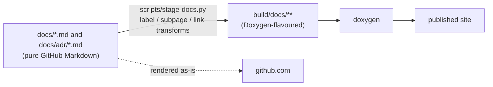

# ADR 0034: Doxygen page syntax is generated at staging time, never committed
<!-- doxygen-label: adr0034 -->

## Status

Accepted. Implemented across the 2026-09 documentation restructure.

## Context

The same Markdown files have to read well in two places: on github.com, where
most people read them, and in the generated Doxygen site (API reference +
architecture overview + these decision records). Doxygen understands a superset
of GitHub-flavoured Markdown — `{#page-label}` for a stable URL, `\subpage` for
a nested page tree, `\ref` for a cross-reference — and GitHub renders none of
it, showing `\ref hioc_protocol "Protocol Layer"` and `{#adr0034}` as literal
text in the page.

The repo used to paper over this by linking things by absolute `github.com` URL
so both renderers cope, or by not linking at all. The result: `\ref` litter in
the first section of `architecture_overview.md`, the ADRs unreachable from the
site, and 38 links that 404'd on the published site while the link checker
stayed green.

The restructure needed two things that require Doxygen-only syntax *somewhere*:
page labels (so a URL survives a file being moved) and a real ADR page tree.

## Options considered

1. **Commit the Doxygen syntax.** Put `# Title {#label}`, `\subpage adrNNNN`
   lists and `\ref` cross-references straight in the `.md` files. Simplest
   pipeline. Cost: every github.com reader sees `{#label}` in the headings and a
   block of literal `\subpage adr0001` lines where a list should be. The primary
   audience pays for the secondary one.

2. **`\if doxygen` / `\if NOT doxygen` twin blocks.** Doxygen's
   conditional-section mechanism (`ENABLED_SECTIONS = doxygen`, already set in
   the Doxyfile). Keep a GitHub bullet list and a Doxygen `\subpage` list
   side by side, each fenced to its renderer. Cost: every block is two copies
   that drift apart, and the `\if` / `\endif` markers themselves render as
   literal text on github.com — the pollution moves, it does not leave.

3. **Generate the Doxygen syntax at staging time.** `make doxygen` already runs
   `scripts/stage-docs.py` (which started life as just a YAML-fence highlighter)
   to copy the docs into `build/docs/` before Doxygen sees them. Extend that
   script: an invisible `<!-- doxygen-label: X -->` HTML comment becomes `{#X}`
   on the first heading; a `<!-- doxygen-subpages -->` bullet list becomes
   `\subpage` lines; a few link forms are rewritten. HTML comments are invisible
   in both renderers.

## Decision

Option 3. **Committed Markdown stays 100% GitHub-flavoured Markdown.** Every bit
of Doxygen-only syntax is injected by `scripts/stage-docs.py` into the
`build/docs/` copy only. The contract:

- Page identity is an invisible `<!-- doxygen-label: NAME -->` comment; staging
  appends `{#NAME}` to the first H1, giving the page a short `NAME.html` URL
  that does not depend on the file's path.
- A nested page tree is an ordinary Markdown bullet list wrapped in
  `<!-- doxygen-subpages -->` / `<!-- /doxygen-subpages -->`; staging replaces
  each bullet with `\subpage <label>`, reading the label from the target file's
  own comment so the list and the labels cannot drift.
- Links that only resolve in one renderer are rewritten — see the link-rewrite
  table in the `stage-docs.py` module docstring.
- Every transform is newline-neutral, so a Doxygen warning reported against
  `build/docs/foo.md:42` still points at line 42 of the committed file.
- `scripts/check-docs-links.py` (part of `make lint`) enforces the invariants:
  every doc staged and in `INPUT`, every label present and globally unique,
  every ADR in exactly one subpage block, and no shipped doc linking into
  git-excluded territory.

## Consequences

- github.com readers get clean Markdown; the Doxygen site gets stable
  `label.html` URLs and a genuine page tree. Neither audience sees the other's
  syntax.
- `stage-docs.py` is now a small bespoke Markdown preprocessor. Its rules live
  in one documented place and `check-docs-links.py` tests each of them, but it
  is one more thing to understand before editing the docs.
- The marker comments are invisible — the point, and also the trap: a
  contributor who has not read this ADR or the script will not know they exist.
  The lint check flags a missing label; it cannot teach the convention.
- The newline-neutral rule binds every future transform. A rewrite that adds or
  removes a line breaks Doxygen's warning line numbers and the check that
  guards them, so any such transform has to pad back to the original height (as
  the YAML highlighter already does).
- The `analysis/` planning documents that drove this work will be deleted; this
  record is the durable answer to "why is the Doxygen syntax generated rather
  than written?".
