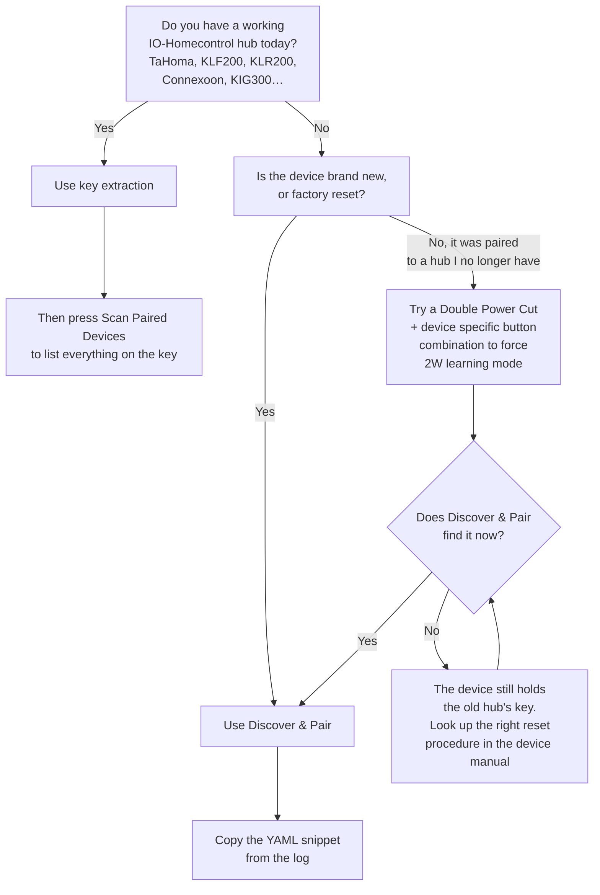

# Pairing
<!-- doxygen-label: pairing -->

Getting a device onto your hub. There are two routes, and picking the right one first saves more
time than anything else on this page.

## Which route should I use?



**Key extraction is the route whenever you already own a hub.** It recovers the same
`node_id`/`system_key` your devices already trust, so nothing leaves its paired state and every
device on that installation appears at once. Most field reports of a device that "never responds
to discovery" have been resolved this way. See [Key extraction](key-extraction.md).

**Discover & Pair** is the route for a device that is genuinely unclaimed: new, or factory reset,
with no hub holding its key.

## Discover & Pair

The button platform adds a Home Assistant button that starts discovery and pairing:

```yaml
button:
  - platform: home_io_control
    name: "Discover & Pair"
```

### Configuration variables:

- `home_io_control_id` (Optional): Reference to the `home_io_control` hub to use.
- All standard options from the ESPHome button schema also apply.

### Notes

- The button defaults to the `config` entity category.
- This `button:` platform exists only for Discover & Pair. Cover favorite buttons are generated
  from eligible `cover:` entries, and Scan Paired Devices is enabled from the `home_io_control:`
  block; neither needs a `button:` entry.
- The companion "Last Pairing Result" sensor follows the button's own `device_id:`, if one is set.

## The pairing workflow

1. Choose a `node_id` (6 hex characters) and a `system_key` (32 hex characters) for the hub, and
   keep them stable across firmware updates.
2. Flash a config with at least the `home_io_control:` hub and the `button:` entity above.
3. Put exactly **one** device into pairing mode, usually a 2 second press of its PROG button. The
   pairing window is short, typically a few seconds.
4. Press **Discover & Pair** in Home Assistant within that window.
5. Watch the ESPHome log. On success it prints a ready-to-paste YAML snippet with `io_device_id`,
   `io_device_type` and `io_subtype`; otherwise a follow-up message says why no snippet could be
   generated.
6. Add those three values to the matching `cover:`, `light:`, `lock:` or `switch:` entry in your
   YAML. If the log printed a raw numeric type such as `0x11`, keep that exact value.
7. Reflash. The entity appears in Home Assistant and the hub starts polling the device for status.
8. If the log says the type is unsupported or the discovery metadata was incomplete, follow its
   guidance and open a GitHub issue with the raw type/subtype, the device model and the pairing
   log.

**Expect this to take a few goes.** The hub retries discovery three times per press, and it is
still common to need two or three presses because the timing between PROG and the button matters.
Press PROG again and repeat before you change any settings.

**If the device never answers**, read
[The device is never found](troubleshooting.md#the-device-is-never-found) before touching
[Radio tuning](configuration/tuning.md). A device that already belongs to a hub has nothing left
to answer a discovery with, and no tuning changes that; key extraction does.

### Diagnosing a failed pairing attempt

Every config with a `button:` entity gets a companion **"Last Pairing Result"** diagnostic text
sensor, with no YAML needed. It updates after every attempt with a frozen, machine-readable
summary:

```
v1; outcome=paired; phase=complete; node=30E1F2; type=awning; attempts=1; lbt=0; dur_ms=842; heard=3; advice=none
```

| Field | Meaning |
|-------|---------|
| `outcome` | `paired`, `no_response`, `invalid_response`, `key_exchange_failed`, or `config_failed` (key exchange succeeded but the best-effort SetConfig1 step failed; still counted as paired). |
| `phase` | The furthest stage the pairing state machine reached. |
| `node` / `type` | The paired device's node ID and type, or `-` if nothing was paired. |
| `attempts` | Number of discovery command retries sent. |
| `lbt` | Listen-before-talk retries consumed across the whole attempt; a channel-busy indicator. |
| `dur_ms` | Attempt duration in milliseconds. |
| `heard` | Total RX events seen, including ones the pairing classifiers rejected and a 1W gesture overheard just before the window opened (see the advisor below). |
| `advice` | Comma-separated advisor codes (see below), or `none`. |

The format is stable and versioned (the `v1;` prefix), so an automation can alert when `outcome`
is not `paired`.

The log also gets a full human-readable summary of every TX, RX, rejected RX, listen-before-talk
deferral and phase event, plus a total channel-hop count. When the overheard traffic tells a story,
one or more **pairing advisor** WARN lines turn it into a diagnosis. The advisor also considers the
15 seconds *before* the button press: a PROG press completed just ahead of it is 1W traffic, not
RF silence, and is reported as `1w_traffic`.

| Advice code | When it fires | What it means |
|-------------|----------------|----------------|
| `1w_traffic` | A 1W remote was seen performing 1W pairing (a broadcast to `00003F` with a 1W pairing command byte). The broadcast does not identify a target, so this fires on any 1W pairing gesture in range. | The motor is **not** in 2W learning mode; a PROG press on a 1W remote does not enable 2W discovery. Do a Double Power Cut on the motor to force 2W learning mode, then retry (issue #27). If that still draws nothing and the device has a working hub, it is almost certainly paired to that hub: use [key extraction](key-extraction.md). |
| `channel_busy` | Listen-before-talk retries were exhausted and the same source was heard repeatedly during the wait. | A repeating beacon (usually a nearby remote or sensor) is flooding the channel and delaying discovery transmissions. Try again, or tune `lbt_max_retries`/`lbt_rssi_threshold_dbm` — see [Radio tuning](configuration/tuning.md). |
| `foreign_controller` | A discovery response (0x29) was seen addressed to a node ID that is not this hub's. | Another controller (a TaHoma, say) is pairing the same device right now. Wait for it to finish, or make sure yours is the only controller with the device in pairing mode. |
| `rf_silent` | Nothing at all was heard on any channel during the whole discovery window. | Separates "RF dead" (antenna, wiring, wrong tuning) from "device is not in pairing mode". Check the antenna and radio tuning before pressing PROG again. |

## Scan Paired Devices

Once you hold a system key — recovered from another hub, or established by pairing — a roll-call
lists every device that trusts it, whether or not you have a YAML entity for it. Each device you
have no entity for answers with a ready-to-paste snippet, and no pairing handshake is involved.
This is the fastest way to bring up an installation after [key extraction](key-extraction.md).

Enable it from the hub block, not as a `button:` entry:

```yaml
home_io_control:
  # ... radio pins, node_id, system_key ...
  scan_paired_devices_button: true
```

The button and the `scan_paired_devices` action run the same roll-call. The action is always
available; the button saves a trip to Developer Tools.

### The `scan_paired_devices` action

It takes no fields. Like the other actions it is named `esphome.<node_name>_scan_paired_devices`;
for a config with `name: hioc-heltec-v2`:

```yaml
action: esphome.hioc_heltec_v2_scan_paired_devices
```

The hub broadcasts a roll-call (`CMD_DISCOVER_SPE_REQ`, 0x2A) and listens for every device that
holds its system key. Responders are grouped into a `Known:` section (already in your YAML) and an
`Unknown:` section, and each unknown one gets a paste-ready block. Either section is omitted when
it would be empty.

```
Roll-call: 2 devices detected (1 known, 1 unknown)
Known:
  30E1F2: horizontal_awning subtype=0 rssi=-52dBm manufacturer=Somfy turnaround=40s power_save=always_alive [known]
Unknown:
  415CE4: light subtype=0 rssi=-61dBm manufacturer=Somfy turnaround=40s power_save=always_alive [unknown]
    Paste this into your YAML to register it:
  light:
  - platform: home_io_control
    name: "My Device"
    io_device_id: "415CE4"
    io_device_type: "light"
    io_subtype: 0
```

### What to expect

- **A scan takes about 6 seconds** and blocks the ESPHome loop for that long. Paired devices
  duty-cycle across the three radio channels on their own schedule, so the hub broadcasts on each
  channel in turn, each with a full `pairing_discovery_wait_ms` listen window, then merges the
  replies. The "operation took a long time" warning ESPHome logs on every run is expected.
- **A device can still be missed. Press again if one you expect is absent.** A scan has no side
  effects, so repeating it costs nothing.
- **Hearing nothing is a valid result.** The result event's `success` is `true` whenever the
  broadcast went out. Its `device_id` is always empty, because there is no single target, and the
  full report above is the event's `message`.
- **At most 24 devices are listed per scan.** If more answer, the report says so with a
  `NOTE: more than 24 devices answered; the list below is truncated.` line rather than silently
  showing a subset.
- **An unknown responder is almost never an intruder.** It usually means a device you paired
  earlier whose YAML entry was never saved. The reply proves only that the device once received
  your system key.
- **It cannot pair a new device.** A device in learning mode holds no key yet and stays silent to a
  roll-call. Use Discover & Pair for that, and the scan to check on devices you already have.
  [`pairing_discovery_commands`](configuration/tuning.md#pairing_discovery_commands) explains why
  0x2A is deliberately not a discovery option.

### Notes on the Scan Paired Devices button

- The button defaults to the `config` entity category.
- There is no companion result sensor. Output goes to the log and to the
  `esphome.home_io_control_action_result` event, exactly like the action.
- The button shows as pending in Home Assistant for the duration of the scan.
- A press is ignored if a radio exchange is already in flight. That can only happen from an ESPHome
  automation pressing the button inside another entity's callback, never from a tap in the Home
  Assistant UI. The result event still fires with `success: false`, so an automation sees the
  rejection.

## See also

- [Key extraction](key-extraction.md) — the route for a device that already has a hub
- [Diagnostic entities](diagnostic-entities.md) — what the companion sensors report
- [Radio tuning](configuration/tuning.md) — when discovery gets no answer
